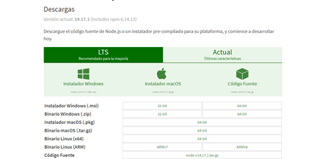
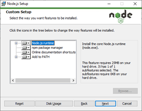
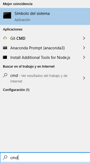
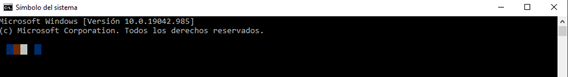
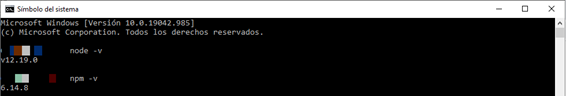

# Node.js

Node.js es un entorno en tiempo de ejecución multiplataforma, de código abierto, para la capa del servidor (pero no limitándose a ello) basado en el lenguaje de programación JavaScript, asíncrono, con E/S de datos en una arquitectura orientada a eventos y basado en el motor V8 de Google.

Fue creado con el enfoque de ser útil en la creación de programas de red altamente escalables, como por ejemplo, servidores web.​ Fue creado por Ryan Dahl en 2009 y su comunidad de paquetes sigue en constante crecimiento.

## NPM

Node Package Manager es el gestor de paquetes de Node. Desde allí podemos instalar Node o cualquier paquete que necesitemos para nuestro proyecto.

En la web oficial pueden consultar la biblioteca completa de paquetes.

https://www.npmjs.com/

<br>

### Instalación de Node.js

1 - Entrar en https://nodejs.org/es/download/ y descargar el instalador de Node.js en el sistema operativo deseado. Podemos elegir entre Windows, Mac y Linux.



<br>

2 - Ejecutar el instalador que acabamos de descargar. Simplemente debemos avanzar en el proceso de instalación.



<br>

3 - Una vez finalizado el proceso de instalación, podemos comprobar fácilmente si se nos ha instalado correctamente. Para ello, vamos al intérprete de comandos de nuestro ordenador (en Windows, por ejemplo, escribir “cmd” en la barra de búsqueda y abrir la aplicación de “Símbolo del sistema”).




<br>

4 - En la ventana de comandos, escribir `node -v` y pulsar la tecla _Enter_. Nos debería aparecer la versión que tenemos instalada de Node.js. Para comprobar que se nos ha instalado también NPM, escribiremos `npm -v` y pulsaremos de nuevo Enter. Nos debería aparecer también en este caso la versión del Node Package Manager (NPM).



<br>

Con estos 4 sencillos pasos ya tendremos instalado y disponible para utilizar todo el potencial de Node.js junto con el instalador de paquetes NPM.

En caso de presentarse inconvenientes en la instalación, puede consultar la documentación oficial en el apartado de _Downloading and installing Node.js and npm_.

https://docs.npmjs.com/downloading-and-installing-node-js-and-npm

<br>

## Ejemplo de Servidor Node.js con HTTP

```js
const http = require("http");

const hostname = "127.0.0.1";
const port = 3000;

http
  .createServer((req, res) => {
    if (req.url == "/") {
      res.writeHead(200, { "Content-Type": "text/plain" });
      res.end("¡Hola mundo!");
    }
    if (req.url == "/otro-link") {
      res.writeHead(200, { "Content-Type": "text/plain" });
      res.end("Otro link");
    }
  })
  .listen(port, hostname, () => {
    console.log(`Server running at http://${hostname}:${port}/`);
  });
```

Ahora podemos chequear en nuestro navegador las siguientes urls:

- http://localhost:3000
- http://localhost:3000/otro-link

<br>

## Ejemplo de Servidor Node.js con Express

_Express_ es un framework para Node.js que nos permite administrar rutas de manera productiva.

Para poder usarlo, necesitamos descargar e instalar este paquete desde NPM en nuestro proyecto. Usando el gestor de paquetes NPM, nos facilitará la tarea.

```bash
npm install express
```

Esto instalará el paquete en nuestra carpeta `node_modules` del proyecto.

<br>

Tomando el ejemplo anterior con HTTP, utilizando Express nos quedaría de la siguiente manera:

```js
const express = require("express");
const app = express();

app.get("/", function (req, res) {
  res.send("¡Hola mundo!");
});

app.get("/otra-cosa", function (req, res) {
  res.send(`Otro link`);
});

app.listen(3000, function () {
  console.log("Servidor corriendo...");
});
```

Como se puede apreciar, gracias a la librería de Express se administran de manera legible las diferentes rutas de nuestro proyecto, permitiéndonos escalar manteniendo nuestro código ordenado.

Ejecutamos la aplicación con el siguiente comando en nuestra consola:

```
node app.js
```

Ahora podemos chequear en nuestro navegador las siguientes urls y obtendremos el mismo resultado:

- http://localhost:3000
- http://localhost:3000/otro-link
